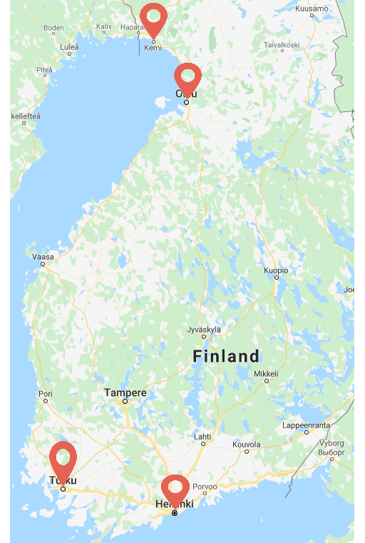
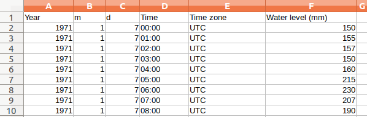

# Bayesian Statistics Global Warming

<b>Motivation</b>: The project was done as the part of "Bayesian Data Analysis" course at Aalto University, Finland as the part of Master's Programme. 

## Introduction
Today, one of the biggest threat to the society is global warming. Sea level rise is the immediate result of
global warming as it melts the ice sheets and expands the water volume. Cities like Venice, New Orleans and
Osaka are expected to experience major problems with the rise in sea level in near future.

Venice is already facing major problems.


Goal of the project is to examine how much the sea level rise affects the coastal cities in Finland. For purpose
of the study, four cities from coastal Finland were selected and the data is from January 1970 to November
2019 is used. Linear regression with Gaussian noise, Error∼N(0,σ<sup>2</sup>), is fitted on the data to check the
threat on Finnish cities.

## Data

To find out about the sea level rise in Finland, historical data is needed about the same. In Finland, the
Finnish Meteorological Institute provides open data about the weather. The data from January 1970 to November 2019 is taken for the study. The
cities are selected in a way that they are evenly distributed around the coast line so that the study covers the
overall situation in Finland. The selected cities are Kemi, Turku, Helsinki and Oulu.




### Format of the Data

Data by Finnish Meteorological Institute is collected every hour for every day throughout the year, i.e. ```24 *
30 * 365``` readings are available for each city per year.



### Data pre-processing

Once the data is downloaded, it is essential to know the zero of the scale of measurement i.e. the height
system in which the values is given. In Finland there are a number of systems available from which N2000 is
used.

Thus, the data is normalized using N2000 data which is available on the Finnish Meteorological Institute
website.

Also, the data is too accurate so the mean of sea level for each year is calculated.

The pre-processing script can be found at ```/src/preprocessing.py```

## Models

A gaussian linear model to the time series data from 1970 to 2019 is fitted. Setting year 1970 as origin
makes the slope parameter relative to year 1970 and the intercept modelled for year 1970. Since measurements
are collected from 4 different geographical locations it is decided to try a hierarchical model in addition to
a separate model.

### Results


## More details  

More details about the project, experiments, and results can be found at the report file, <a href="Impact_of_Global_Warming_on_Finland.pdf">project report</a>
